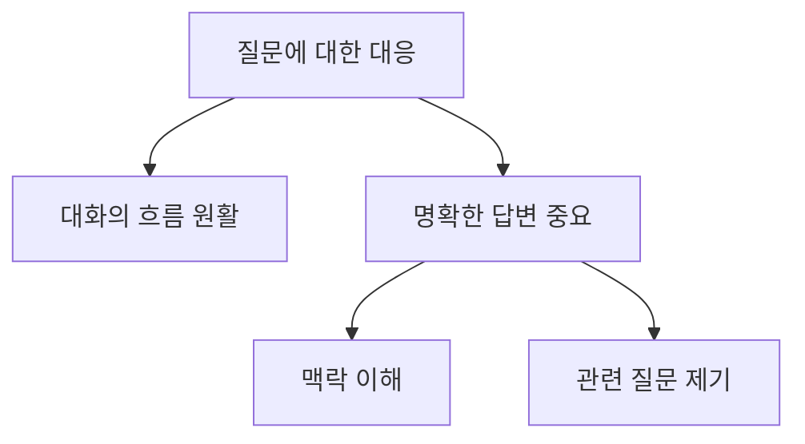

---
audio:
  - "[[scribe-recording-2026-03-31.105.webm]]"
created_by: "[[Scribe]]"
---
# Audio
![[scribe-recording-2026-03-31.105.webm]]
제가 그 질문에 대응하는 걸로
## Summary
## 질문에 대한 대응
- 질문에 대한 대응을 언급함

## Insights
## 통찰
- 질문에 대한 적절한 대응은 대화의 흐름을 원활하게 함
- 질문에 대한 명확한 답변이 중요함

### 개선 사항
- 질문의 맥락을 명확히 이해하고 대답하기
- 대화 중 다른 관련 질문을 제기하여 토론 확장하기
## Mermaid Chart

## Answered Questions
## 질문에 대한 대응
질문에 대한 적절한 대응은 대화의 흐름을 원활하게 하고, 명확한 답변이 중요합니다.