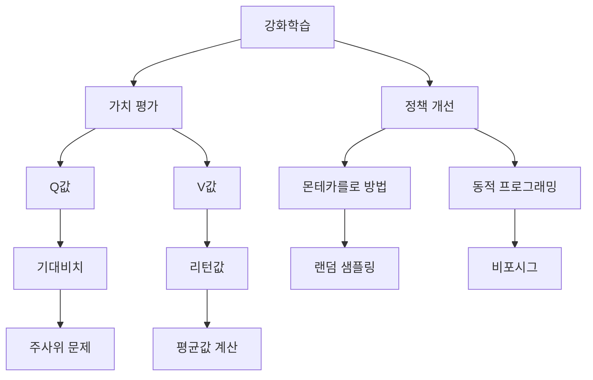

---
audio:
  - "[[scribe-recording-2026-04-01.webm]]"
created_by: "[[Scribe]]"
---
[05_]# Audio
![[scribe-recording-2026-04-01.webm]]
V는 S에 대하고, V하고 Q는 사실 거의 같은거에요. Q는 S에 대한 액션에 대한 가치를 들어갑니다. 어떤 상태에서 어떤 액션을 했을때 어떤 가치를 이 액션이 여러개가 있게되면 Q값의 평균값이 여기까지 나옵니다. 네 방향이 있었잖아요. 네 방향의 Q값을 평균을 하면 이걸 어떻게 구하느냐, 이걸 구한거부터 어떻게 또 이걸 결정하느냐 두가지가 있었고, 이게 폴리식 이벤트 레이저입니다. 가치를 평가하는, 이게 밸류로 구하는거죠. 폴리식, 현재의 정책, 폴리식은 액션에 대한 정책의 액션 파일, 정확하게 액션에 대한 probability죠. probability를, 현재의 가치를 구하는 과정이고, 이거로부터 폴리식을 인플로그먼트, 결정하는거죠. 이를 구하고 파일을 구하는거죠. 두개가 왔다갔다 하면서 이터러티브하게, 이걸 이제 수학적으로 구하는거는 전전시간에 하는거고, 경력실도 크고 막 했는데, 손으로 가늠을 하는게 어렵다. 다이나믹 프로그래밍, 다이버리즘을 써서 비포시그하게 구했습니다. DP라는건, 이런 이런 이런 이런 걸 보면, 모든 스테이크에서 다 구하는거죠. 다 구해야 되고, 뭘 구할때 옆에 이유값을 활용을 해서 구해나가는거죠. 어쨌든 그정도에서 자랑한것들이 있는데, 개념이, 스테이크하고 액션, 리워드하는게 많이 익숙해졌고, 폴리식, 어떤 액션을 구할 것이냐, 거기다 확률이 좋지, 어떤 액션을 구할 것이냐. 액션을 할 것이냐를 할 때 기본적으로 가치를 구해서 Q라는 액션을 구해서 가장 높은, 가장 최대한 높은 액션을 찾게 되면 그리지 방법이 있어서 돌아갔습니다. 전체적으로 가치를 구하는 것에 대해서는 동작했고 그리지라는 것에 대해서는 동작했습니다. 오늘은 DP하고는 좀 다른 방법으로 똑같은 문제, 폴리스를 평가하고 폴리스를 구하는, 인플루언트하는 그 과정인데 DP랑은 전혀 다른 방법을 사용한 것입니다. 몬테카를로 메시지라는 방법입니다. 대부분 논문읽는 친구들은 몬테카를로라는 말이 가끔 나와요. 몬테카를로라는 방법은 여기저기 나오게 되는데 몬테카를로는 도박하는 동네의 이름인데 그래서 몬테카를로 어쩌고저쩌고 나오면 도박이라는 영어에 도박이라는 게 있는데 몬테카를로는 랜덤 샘플링과 관련된 작업을 할 때 반복적인 경우에 대해서 몬테카를로 방법입니다. 이런 말을 써야 돼요. 랜덤 시뮬레이션이라고. 원래 원하는 걸 하는 경우에 대해서 압수를 구한다든지 추가하는 경우에 대해서 몬테카를로 메시지를 써요. 가장 단순한 방법인데 컴퓨터 활용하는 방법이죠. 핵심이 랜덤 샘플링이다. 여기저기 보면 그래서 여기저기 그림이 나오는데 이렇게 되어있어요. 뭐냐면 원주육을 구하는거에요. 원주육이, 원주는 알죠. 파일값, 파일값, 파일값. 이제 뭐 3.1425, 쭉 나가잖아요 그치? 이 값을, 이 값을 어떻게 구했겠느냐 그치? 옛날에 고등학교 때 한번 들어본적이 있었는데, 이거 구하는 방법에 대해서 그치? 석줄을 세고 하늘에서 떨어진게 아니라, 이게 뭔가의 어떤 값이거든. 이게 보통 파일, 어떤 면적, 할 때 그치? 어떤 원의 면적이, 반주름의 알이 원의 면적이 파일 알죠. 알수록 이거에요. 면적인데. 그러면, 이 면적이잖아 그치? 이 면적을 따지게 되면 이 값이 나오네. 만약에 반주름 1이라고 하면, 반주름 1인 경우에 이 면적. 면적이 뭐니까? 길을 대야겠다 그치? 이 파일. 이 파일을 하게되면 이건데, 면적이라기 보다는 이거는 그치? 둘레, 둘레. 실을 가지고, 실을 가지고 1인짜리 걸 가지고 이렇게 둘렀을 때, 실을 따지면 끊어져 왔을 때, 그치? 실제 길을 보니까 3.1cm로 나와. 그렇게 찾는 방법이긴 한데, 그게 원주유에요. 그치? 비율이잖아. 비율. 이거하고 요게 길일 때, 둘레의 길이가 파일이 된다. 그건 이제 정의는 그런데, 그걸 어떻게 재고 치냐? 자로 재고 치냐? 아깝지 않지. 그치? 그래서 나는 방법이, 아이디어가 이런거에요. 이렇게 이제 자각형을 만들어요. 자각형. 가로자로 1인 자각형을 만들어요. 자각형의 면적이 1인이죠. 그 다음에 반주름이 1인, 1이 있어요. 그치? 요거의 면적이 얼마일까? 이게 반주름이 1인, 1의 면적은, 파이 알루미늄이니까, 파이가 전체의 1인 면적이고, 4분의 1이니까, 4분의 파이가, 요거의 면적이에요. 요거의 면적이 4분. 요거의 면적이, 빨간거가 들어간게 4분의 파이가 되겠고, 전체의 면적은 1인이죠. 사각형의 면접, 면접분의 1 4분의 1을 원의 면접을 따지면 사각형 면접은 1이고 이거는 파이의 4분의 1, 이 비율이 4분의 파이입니다. 전체 면접분의 이거의 면접분이 4분의 파이인데 이거는 마치 여기서 난소를 발생시킵니다. 난소를 막 발생시켰을 때 이거 안에 찍힌게 우리가 이제 날이라고 합니다. 날이로 원 안에 찍힌걸 날, 다음에 원 밖에 찍힌걸 비. 이거 카운트합니다. 난소를 막 발생하면 내 눈에 나오겠지 그렇지? 그러면 여기 안에 찍힌게 예를 들어서 손소독 6이 나오고, 그리고 그 비율을 따져보게 되면 그 비율이 나오겠죠. 그게 4분의 파이입니다. 그래서 이게 비율을 해서 파이라는 것은 이렇게 나옵니다. n이라는 것은 두 개를 더합니다. 전체의 개수, 전체 찍은거의 개수고 i라는 것은 이 안에 찍힌 빨간거의 개수입니다. 전체의 개수하고 빨간거의 개수를 비율으로 해석하게 되면 한 번 숫자를 좀 돌려. 처음에는 어떻게든 찍히면서 숫자가 늘어나죠. 늘어나면서 이 값이 3점에 제일 가까워지는 겁니다. 그렇죠? 숫자가 늘어나면서 그렇지? 적을 때는 아무래도 숫자가 틀리겠지 그렇지? 계속 많아지면 끊어집니다. 이게 뭔지 알 수 있을거에요. 원하는 숫자 찍을 때 단순히 다 찍어오자는 얘기에요. 그리고 이게 변중이 됐다가도 오래가게 되면 추적하면서 숫자가 늘어납니다. 그것도 뭔가 값을 보한다든지 이런 실험결과를 확보할 때 난수를 발생해서 랜덤하게 찍는 경우가 많죠. 이런 많은 실험들이 그렇잖아. 테스트할 때 랜덤하게 테스트해버리잖아. 그렇지? 그게 괜찮으면 아예 단추가 괜찮은 것이라고 하는 것도 일종의 원데칼로 보시면 그 점에 필요치지 않고 랜덤하게 아무 생각없이 랜덤하게 찍어가지고 이렇게 해봤더니 괜찮다. 그거를 정확하게 증명하면 어때요? 개수로 굉장히 많아요. 많을수록 그게 좋은게 아니냐? 진뢰가 좋은거죠. 실험할때도 실험에서 개체 수가 충분한지 아닌지를 논하는게 굉장히 중요합니다. 10개 정도 증명이 됐다. 먼데칼로라가 모르겠지만 이 초점이 있어요. 머릿속의 증명입니다. 자 이거에요. 이걸 우리가 지금 decision making이나 policy를 평가하고 컨트롤하는거에요. Evaluation하고 Improvement하는걸 쓰겠다는거에요. Evaluation, 가치를 구할 때, 밸량을 구할 때 이런 방법으로 쓰겠다는 얘기인데 감이 안오네요. 가장 핵심은 이런게 있고 조금 더 넘어가서 조금 더 넘어가서 이건 조금 더 말하는 겁니다. 주사위 문제 합입니다. 굉장히 쉬운 확률문제인데 주사위 두개를 가지고 던져요. 처음에 한개를 던지면 1,2,3,4,5,6이 나오겠고 1이 나온 다음에 던져서 합을 구합니다. 두개의 합을 구합니다. 두개 던져서 두개의 합을 구하면 두자가 2부터 10위까지 나오겠고 그거에 대한 확률을 계산하게 되면 쉽게 구할 수 있죠. 배수는 36%이고 경우의 수가 긴 배수에게 일어납니다. 10위 나올 확률은 당연히 구할 수 있습니다. 그래서 이거의 기대치는 곱해서 더해지는 7.0입니다. 깨끗하게. 이거는 모델을 가지고 확률 모델을 가지고 구합니다. 이거는 이렇게 따져보면서 더 슬펄슬해서 구하는 소학적인 방법이라고 볼 수 있죠. 분포 모델 확률이 6분의 1이 나오고 확률이 6분의 1이 나오고 분해보건이 분해되서 30분의 1, 그리고 30분의 2, 그런식으로 계산을 하고 왔다갔다 하다 보니까 이 부분을 규모 모델링을 해서 구하는 것이죠. 어떤 부분을 하나 더 만들었을까 하는 분해가 있습니다. 유니폼 디스플레이저입니다. 모델을 가지고서 우리들한테 다음 모델을 가는 겁니다. 일종의 모델을 가지고서 하는데 이거를 우리가 이런건 몰라. 주사위를 쏘게 하는건 없어. 그냥 눈 감고 던지는거에요. 샘플로 가는거죠. 랜덤 샘플을 많이 던져요. 반복적으로 던져야 되니까. 어떻게 하면 될까? 우리 계속 던져보는거겠지? 하루종일 던져서 통계를 내게되면 그 확률이 나올거에요. 미리 시켜서 아니라 구첩으로 던져야 되니까. 이게 이런 포즈입니다. 이런 포즈에요. 그래서 주사위가 2개에 대해서 1, 2, 3, 4, 5를 하나 던지고 또 한번 던져요. 탑을 구하는거에요. 그게 샘플이고 처음에 10이 나오고 4가 나오고 8이 나오겠지. 이런걸 가지고 이 중에 주사를 던지는거에 대한 샘플이 있고 이걸 어떻게 해요? 이걸 가지고 천번을 하는거죠. 천번을 천번을 돌리게 되는거죠. 아까 똑같은거를 천번을 쭉 하게 되면 그래서 그 다음 전체에 이걸 다 저장해서 확산한 다음에 천번을 나누게 되면 평균값이 나오겠죠. 7이 원래 1호치였어요. 7이 1호치인데 그걸 모르더라도 6분의 1도 얼마나 돈을 모으셔도 되고 다음 값을 다 N으로 나누게 되면 어떻게 봅시다. 할 수 있고, 다음은 밴딧 할 때 우리가 보세요. 찾아보면 요거는 요렇게 또 요런식으로 바꿀 수 있다는 것을 밴딧 퍼블로 공부할 때 조금 더 인크리미어 턴 하는 방법이 있습니다. 증분을 이용해서. 이거는 할 때마다 더해서 나눠주면 되겠지? 불편하니깐, 그때그때 누적시켜봐야 되겠지? 직전에서 구한 값을 뺏어가는 이런 증분의 방법을 하다가 더 효과를 발휘할 수 있다. 똑같은 계산이지만 요런 식으로. 트라이할 때 갖다가 증분을 하는게 있어서 딱 샘플이 좋죠? 이 정도면. 두 개를 같이 숫자를 구해서 뺏을 값을, 샘플 값을 갖다가 앞에서 구하는 것하고 뺏어, 나뉜 다음에 더해줍니다. 요 계산을 쭉 계산하게 되면, 처음에는 4 이렇게 나가다가 1000개정도 가면, 3값에 가까운 7정도가 나와요. 이렇게 우리가 확률모델이 없어져서 멤버 샘플을 통해서 할 수 있겠다. 그리고 요거는 우리쪽에서 효과가 되겠다는 생각을 할 수 있습니다. 지금 우리쪽에서의 고민은 가치값, V값, State Value든 Action Value든 가치를 찾는게 복잡했어요. 계산도 있겠지만 복잡했는데, 이 개념을 써서 앞에서 했던, 랜덤 샘플을 통해서 단순하게 한번 보여주자. State Value 공정은 계속 정의하지 마세요. 계속 나오고 있죠? 이제 여러분이 익숙한거 아시죠? 리턴값이 옳지? 리턴값은 이거는 이제 현재 보상에다가 앞으로 나오는 보상값을 합득 보상 현재상태에서 옳지? 예측된 앞으로의 보상 리턴값 이것을 잡다가 이것을 진대 그 값을 구할 때 어쨌든 그 전에 다이나믹 프로그램으로 써주셨을때는 이런식으로 했죠? 직전상태에서 주변에 있는 이런거 요거에 대한 스페이스로 하게되면 주변에 있는 액션을 요기에 있는 값들을 가지고 요기에 있는 값들을 가지고 요 값을 기산으로 계산하는거죠. 요 시간을 보니까 여기서 알아야될게 전의 확률을 좀 알아야되죠. 액션에 대한 확률을 좀 알아야되죠. 이런것들을 좀 알아야되죠. 어렵진 않았지만 이걸 구하는 과정을 계속 반복하면서 우리가 결과를 구했으니까 이 과정 이라는 과정은 전혀 구하러 모르고 전혀 몰라요. 전혀 모르고 하는 방법은 언덕깔을 반복하는것은 새로운거에요. SLO시작을 하는거에요. 우리가 그리드홀 동작을 많이 해봤기 때문에 SLO시작 이게 단점이다. 여기서 SLO채 여기서 SLO채 여기서 SLO채 랜덤하게 이러면 움직이는거죠. 여기서부터 시작해서 내가 어디 어디 왔다갔다 하다가 볼에 쫓아오게 이때 첫번째 지도에 샘플에 대해서 여기에 대해서 얻는 값을 우리가 G1이라고 리턴값이 있겠죠. 이렇게 해서 첫번째 지도에 두번째 또 랜덤하게 했는데 우리랑은 다른 길을 가는거에요. 막 가속하다 목표점 가속하다 보니까 리턴값이 또 있겠죠. 이걸 아까처럼 1000번 이상 100번을 하더라도 n번을 해. 그래서 나누게 되면 결국 이게 기관이예요. 기대치 아니에요. 지금 상태에서의 리턴에 대한 평균치를 조합시켜요. 그야말로. 여기서 이제 차이가 있는게 여기도 이렇게 표시한거고, 요거는 시도라고 하는데 우리가 이쪽에서 에피소드라고 합니다. 시작점부터 끝까지 가는 경로죠. 크랩 경로. 첫번째 에피소드에서는 3이 나와요. 두번째 에피소드에서는 2가 나와요. 그래서 어쨌든 평균값이 2.5가 얘의 현재 값이예요. 이게 많아요. 이걸 갖다가 여기다가 표시하면 랜덤하게 하죠. 랜덤하게 했더니 이렇게 해서 첫번째 에피소드가 이렇게 나온거죠. 두번째 에피소드가 이렇게 하다가 이렇게 하다가 갈수도 있어요. 여러 프라이를 랜덤하게 해가지고 그때 가죽한 주입값이 막 나와서 평균을 따지게 되면 얘 몸값이 나옵니다. 그쵸? 얘 몸값이. 어딘가 리오드에서 받는 데가 있고 리오드에서 빼고 오는 데가 있긴 있을거에요. 얘에 대해서 백화점으로 봤을때는 이거의 정의값이예요. 얘 여기까지 가는데 얘를 수입 리턴값이라는 것은 이러한 반복을 통해서 보호하는 방법도 합리적으로. 다만 이 두가지는 많아요. 한두개 가지고는 안되고 수십개 수백개 수만개 있을때 오히려 훨씬 더 정확할 수 있습니다. 이걸 하려면 이런거에 대한 수학적인 데이터가 있겠죠. 이게 틀릴수도 있고 틀리게 되면 이거는 DP가 정확한게 아니에요. 실제 해봤기 때문에 오히려 더 정확할 수 있다. 이게 아이디어죠. 시시하죠. 가치를 구할 때 가치의 정의가 뭐에요? 정의값이에요. 리턴값이에요. 여기서부터 목표치까지 가는데 얻을 수 있는 총수입은 평균이 리턴이란 말이에요. 그대로 정의를 해서 여기서 여기까지는 모든걸 만들어 보셔야되요 이렇게든가 저렇게든가 계속 얻을 수 있는것들 계산하고 계산하면 되는거죠. 여기에 플러스 보상이 5원 마이너스 보상 계산하고 계산하면 되는거죠. 저세팔상으로 계산해주면 되죠. 그걸 가지고 평균을 때려버리고 평균이야 평균. 평균 내면 참... 이게 중요한게 앞으로 여러분 강화학습에서 이렇게 신뢰하는게 있는겁니다. DP하고 먼저카롤러가 같이 가는데 먼저카롤러가 조금 더 영향을 많이 주죠. 이유가 뭐냐면 우리가 스테이트하는게 9개의 전화수행이 가능하지만 보통 우리가 스테이트라고 했을때 카메라 영상이 그러잖아. 픽셀은 스테이트야. 수백만개의 스테이트가 된단 말이야. 그걸 가지고 판다는거 굉장히 어렵겠죠. 그러니까 우리는 전체를 다 들여다보진 못해. 일부가 볼 수 밖에 없어. 일부 샘플링을 통해서 얘 가치를 추적하는거지. 다가올 수도 없겠지. 그렇지? 몇십개 돌려가서 얘가 가치가 이렇다 이렇다 이렇다 그렇지? 그렇게 될 수 밖에 없어. 그렇게 해서 가치를 우리가 판단을 하는데 우리가 러닝이라는 말을 엔젯으로 쓰기 시작합니다. 이런걸 통해서 가치를 구하는것이 러닝이야. 학습이 좋지. 가보는거지. 내가 얻은걸 가지고 저장하는거지. 러닝개념이 들어가지. 여기다가 지도해보는거지. 시험해보는거지. 이 피해자는 뭐에요? 피해자는 컴퓨팅이야. 계산만 계속한거야. 그렇지? 계산만 계속했지. 그걸 러닝이라고 하면 러닝이라고 하는거지. 지정된 계산 알고리즘에 따라서 한것이고. 이거는 여러분이 아는 지도와 시간 차이가 있지만 그래도 잡을 수 있는 문제를 뒤져보면서 나름대로 이 데이터를 가지고 가치로 우리가 판단하는거지. 그렇지? 그리고 학습. 이것도 학습데이터라고 할 수 있어요. 학습변만 조금씩 등장하는데 이렇게 들어가면서 이게 이제 모든걸 그렇게 결정할수가 없습니다. 일부만 세플링 하는거고 이게 스펙치마이크 DPM 컴퓨팅이고 얘는 랜덤 세플링이냐 러닝 MC란 말을 많이 써요. DPMC 조금 더 구체적으로 요 스테이트 베리오를 보았는데 리턴값이죠 리턴값 리워드의 합이죠. 그걸 보았는데 여기서부터 시작해서 A B C 목적지까지 여기에 보상이 있어요. R1 보상이 있고 R2가 있어요. 이렇게 계산할때 당연히 요기에서 요 스테이트 A에서의 리턴값이라는 것은 그것도 해주면 되는거죠. 이렇게 해서 B에서의 리턴값으로 보았는데 당연히 이게 되겠죠. 이렇게 하면 되요. 계산하면 되는건데 그래서 값값을 스테이트를 G A G B G C 이렇게 하는거고 이걸 뒤집어 버렸어요. 만약 그러면 G A구하고 G B구하고 G C구하면 값값 할수 밖에 없어요. 그런데 거꾸로 GC를 먼저 보여요. GC라는 것은 뭐죠? 목적지에서도 가까운 줄이예요. 거꾸로 가까운 줄을 봐야죠. G B는 여기서부터 G C를 찾아볼 수 있어요. 값값이 패스라고 할 수 있어요. 시장만 정확한지 몰라서 경로 경로에요. 에피소드에 있는 경로를 봤을 때 G A 같은 경우는 여기서 이걸 뽑혀주면 되니까 계산상 교육입니다. 우리가 이쪽 할 때 리턴구 할 때 거꾸로 찾아요. 거꾸로. 여기서부터 시작해서 이쪽 에피소드 만들면서 이 값들을 다 저장합니다. S 값하고 스테이트에 대한 S A 스테이트 값 S 1 S 1 에피소드 다 저장해놨는데 리턴구 그러면 스톱으로 다 그려놓은 다음에 이거 그대로 다 그려놓은 다음에 역방향으로 가면서 스틱과 스틱이 스틱을 그려놓고 뒤에 나오니까 스틱을 그려놓을 수 있어요. 그래서 스틱에 하나가 됩니다. 근데 이게 이쪽은 다만 어떻게 하려고 하는 방법이 있다면 역스틱까지는 패스하고 앞으로 다시 일단 메뉴를 저장해놓은 다음에 그 다음에 그걸 따라가면서 계속 이걸 봐야 돼요. 쭉 각돈하고 중간에 만났던 보상각돈 메뉴를 저장해놓은 다음에 거꾸로 따라가면서 앞으로 따라가는게 아니라 거꾸로 따라가면서 A에 대한 보상을 걸을 때 A에 대한 보상이 아니라 리턴 자 끝났어요. 끝났네요. 푸쉬 마이너가 있기 때문에 저장할 알고리즘은 폴리쉬 이외로 되어있죠. 상당히 효과적이죠. 폴리쉬 결정한 데이터는 먼저 판단을 해야 됩니다. 스테이트가 어떤지에 대한 평가를 하고 그 다음에 평가된 거로부터 인플루를 시키고 인플루된 거로 평가하고 그 다음에 인플루를 하게 해서 반복적인 동작을 한거죠. 전체적인 건 똑같은데 먼저 상대 비교 레이저는 지금 했던 얘기를 좀 상상적으로 하고 타이어하고 V값이죠. 초기화를 시켜놓고 초기화를 시켜놓고 첫번째는 에피소드를 만듭니다. 어떻게 만드느냐 일단 랜덤으로 만드는거죠. 에피소드라는게 여기서부터 어떻게 갔냐 파이에 따라 에피소드가 생성이 됩니다. 그러면 에피소드에 따라서 쭉 가면서 스테이트가 나오게 되면 그 스테이트에 맞는 리턴값을 계산을 하고 저장을 합니다. 저장을 해서 나중에는 리턴값의 평균을 위해서 한다는 겁니다. 이게 한번 돌 때 첫번째 에피소드에 대해서 파업 덕후를 저장하고 두번째 에피소드에 두번째 에피소드에 두번째 목적지에 가는겁니다. 도달할때까지 첫번째 에피소드를 해달면서 한다는것을 그냥 평가하고 에피소드를 통해서 평가하는것이구요 메모리라는 액세서리입니다. 이것들이 다 저장되어있습니다. 코드레벨로, 이 부분은 코드레벨로 가도 되구요. 특별한게 없기 때문에 빌드월드 클래스의 스텝이 스텝이라는것은 현재 상태에서 액션이 들어가있을때 모든쪽으로 간다 액션이 들어간다. 이쪽으로 이동하는거죠. 그거에 대한 얘긴데 액션에 따라 스테이트를 결정하고 리워드까지, 그 상태에서 리워드를 받을수 있는지, 목적지에 도착했는지 재개를 끝나면 되죠. 재개를 시킵니다. 리셋, 빌드월드에서 리셋이라는것은 다시, 처음 스타트점으로 다시, 에피소드가 계속 여러개를 만들어져있기 때문에 끝나면 다시 리셋시켜서, 처음 스테이트로 무게하는것 같습니다. 다음에, 포르시평가는 에피소드를 만들어야하는데, 만들어야하는건 랜덤 에이전트랑 클래스로레어로 만들어야합니다. 랜덤 에이전트입니다. 이게 아마 그전에 에이전트에 나왔던것과 비슷해요 비슷한데 각만의 로봇들의 액션 네 방향의 로봇들 네 방향의 로봇들 네 방향의 로봇들 그래서 처음에 각의 액션, 레프트 라이트 업 다운을 0쪽으로 이루어주고 어디 갈지 몰라요 평가할때는 랜덤으로 어떤 일이 벌어지냐면 스타트에서 시작해서 여기 가는데 왔다갔다 하다가 이런식으로 벌어질수 있어요. 굉장히 다양한 이런식으로 하는건 운이 좋은거고 랜덤으로 처음에 타입값을 랜덤 액션에 맞춰서 저장을 하고 구입값, 가치값은 0으로 표결시킵니다. 카운트, 에피소드의 카운트에요. N을 갖다놓은채 카운트를 하는거고 중요한게 메모리에요. 메모리가 랜덤으로 움직이면서 뭘 저장하느냐 처음 시작점에서의 스테이트, 어떤 액션 다음에 이제 다음으로 갔으면 다음에서의 스테이트 액션 이걸 쌍으로 해서 목적지다 중간에 갈 경유 스테이트들을 저장합니다. 한번 에피소드가 끝나면 이건 뭐지? 리셋을 시켜야지 하나의 기종에 하나의 에피소드에 대한 기록들이 쭉 쭉있어. 첫번째, 두번째, 이렇게 치게되면 여기가 여기가 스테이트마다, 이동한 스테이트마다에 나가면서 그것들을 저장합니다. 이게 저장이 되면 그래서 요거는 이거 메모리고 메모리는 그런 용도의 메모리입니다. 그럼 함수를 봅시다. 액션이라는 것은 어떤 스테이트에 왔을까 이 스테이트에 와서 어떤 액션을 할 것이냐 이건 오른쪽 4가지로 갈 수 있는 거죠. 액션을 어디에다 쓰냐면 완전히 여기서 파일을 가집니다. 0.2가 아주 좋지. 랜덤으로 가집니다. 완전 랜덤. 어디서든 어디로라도 전환이 가능합니다. 완전 랜덤. 그게 액션입니다. 랜덤 액션입니다. 액션이라는 것은 예를 들면 이동을 하게 되면 이동을 하게 되면 로봇들이 하나씩 쌓이겠죠. 이걸 갖다가 메모리에다가 하나씩 쌓아갑니다. 이동할 때마다 리셋이 목적지에 도착해가지고 리턴 값이 계산이 돼요. 그럼 이제 초기화시켜야 되죠. 전체로 초기화시키는 겁니다. 그래서 이벤트웨이저에 관한 것은 하나의 에피소드. 원앱. 여기서부터 이렇게 갔다. 이 에피소드에 대해서 저장이 된 상태에서 G값을 향해서 G값을 향해서 G원으로 G값을 향해서 아까 거꾸로 한다고 했잖아요. 반대 방향으로 반대 방향으로 가면 메모리의 역방향 역방향으로 스테이지 액션이 나오게 되면 이거죠. G는 거꾸로 돌아가면서 카운트를 해가지고 결국 스테이지 값이 지나가면 스테이지 값 각 스테이지 값에 대한 부위 값을 그냥 한 번 고정해볼게요. 처음에 제로였던 것이 얘네들이 있는 스테이지 값이 업데이트 이렇게 하려면 여기부터는 스테이지 값이 업데이트 계속해서는 다 업데이트 안될 수도 있어. 이거는 확실하게 업데이트 해야 돼. 돌아다니면서 각 스테이지 값을 계속 업데이트 스테이지 값을 만들고 호흡을 하면서 스테이지 값을 승급을 통해서 이걸 만들 수 있어야되나? 만들고, 만드는 기간을 위해서 V값을 업데이트 할 수 있습니다. 어쨌든, 실습하면서도 실험을 통해서 어떤게 쉬우니까 여기 들어있는 이 의미가 V값입니다. 그래서 하나를 구합니다. 메소드에 대한 것을 구했고 우리가 하고자 하는 것은 1000개의 기술입니다. 메인입니다. 메인 알고리즘은 랜덤 에이전트 이런 이름으로 사용하는 것이죠. 1000개에 대해서 천번이 넘는 거예요. 천번이 넘어서 처음에 데이트를 리셋시켜놓고 무한 반복 반복해서 목표에 도달하면 평가가 끝납니다. 의자로 처음에 여기서 이제 기자를 해서 만들었더니 이렇게 갔더라고요. 첫번째가 이게 액션을 첫번째 액션을 통해서 이렇게 가고 목적지에 도착하면 가면서 뭘 하냐면 우리가 스텝 다음 스텝으로 이동을 하는거지. 이동하면서 여기서 있었던 s, a, r 들을 메모리에 쭉 저장하고 쭉 저장하면서 가가지고 메모리가 쌓이겠죠. s, a, r이 쌓이고 s, a, r이 쌓여서 여기까지 왔습니다. 여기에서는 쭉 훑어가면서 주값을 썼습니다. 첫번째 주값입니다. 첫번째 주값을 이렇게 해서 계속 돌면서 이걸 계속 카운트하면서 계속 돌면 돈에 따라서 최종적으로 나오는 것은 데이트값이 무한 반복입니다. 그래서 이걸 보면 처음으로 나오는게 이거에요. 3x4에 대해서 이게 마이너스 3.0 이렇게 나오는데 똑같은 문제에서 dp를 구한건데 비슷해요. 0.0, 0.08, 0.08, 0.17, 0.2, 0.44 비슷한데 조금 다르죠. 이건 푸른 값이라고 보는데요. 푸른 값이고 이건 샘플링을 통해서 구한 값입니다. 샘플이 늘어난다는 점을 조금 더 유사해 줄 수 있겠죠. 이렇게 기술에서 한다는 것을 알게되면 이렇게 복잡하다고 그럴 땐 나름대로 이퀘이션을 하나도 몰라도 될거에요. 아무것도 알게될 필요가 없어요. 보상서만 가지고 저장해놔서 쭉 가면서도 저장해서 옵데이크를 계속 하면서 옵데이크를 시켜서 이것만 해도 돌아가게되면 이게 에피소드입니다. 첫번째 수습은 요구하시는거에요. 지난번에 해본게 있기때문에 빠르게 랜덤 에이전트 하는 것을 만들고 나름대로 의미를 잘 파악하시면서 에피소드라던지 파악을 바꿔보면 되겠죠. 이것을 치면 랜덤 에이전트 이게 랜덤으로 움직입니다. 실패했다고 치고 컨트롤 인플루언스 인플루언스를 평가하는 방법을 알았으면 이것을 기반으로 해서 페어폴리시를 만들어주는 과정이 필요하겠죠. 페어폴리시를 가치를 보여줘요. 가치로 볼 때 랜덤 에이전트 가치로 볼 때 움직여서 아까 V를 썼는데 Q를 액션에 대한 평가를 구했고 평가하는 것 Q를 구했고 그래서 우리가 액션에 대한 최적의 액션을 우리가 파이널이니까 반복을 하는거고 인플루언서라고 했고 DP랑 DP에서 했던 개념이 여기 그대로 있어요. 3개 있을 수가 없어요. DP에서 사용을 했던 MC가 되는 폴리스를 구해서 개선하겠다는 전체적인 문제라면 전혀 똑같습니다. 기호가 조금 책에 따라 바뀌어 있어서 그런건데 Q로 가게 되는 이 중에서 Q값을 제일 높이는 액션 그래서 어떻게든 하고 이 액션을 들어간 새로운 언어로 같이하면 같이하면서 같이 올라갑니다. 반복될 때는 이렇게 하고 똑같이 거기다가 입다운될 때와 동일하고 그리고 이제 우리가 실제 액션을 선택할 때는 V함수가 아니라 스테이크가 아니라 액션을 Q함수에 쓸 수가 있어요. 이걸 갖다 버렸어요. 이건 액션이 들어갈 수 있는 것입니다. 스테이크에 넣을 수 있습니다. 스테이크에 넣을 수 있지만 A까지 들어갈 수 있어요. 여기에 이거에 비교하면 0.2 이게 되면 Q값은 여기에 4개가 있어요. 이렇게 표시되면 위로 갈 때 위로 갈 때는 0.2 옆으로 갈 때는 0.3 그다음에 왼쪽으로 갈 때는 0.2 아래로 갈 때는 0.5 이렇게 해서 액션마다 같이 액션을 잡을 때는 Q값이 있어야 해요. 평균이 V값으로 그래서 이걸 액션을 구하는 루틴에서는 V보다는 Q를 쓰는게 합리적이죠. 그래서 Q값도 동일합니다. Q값이라는 것도 역시 리턴값이에요. 리턴값이기 때문에 액션을 했을 때의 기대비치죠. 에피소드에 대한 기대비치를 똑같은 방법으로 구합니다. 액션이라는 게 변수가 있기 때문에 그걸 통해서 인증하는 전체적인 알고리즘에 도움되는 투가 중요하다고 생각합니다. 컨트롤을 한마디 하는게 용어가 좀 특별해요. 이쪽에 강화학습 쪽에서는 컨트롤을 한마디, 그 다음에 인플로버를 한마디. 폴리스 인플로버, 폴리스 업데이트 한마디만 있어요. 폴리스 업데이트, 폴리스를 바꾼다는 의미, 대사만을 바꾼다. 그것도 폴리스를 컨트롤한다는 의미, 폴리스를 체험한다는 의미. 같은 용어, 폴리스를 바꾼다. 타입값을 결정하는거에요. 액션한다는 뜻의 액션한다는 것을 표현합니다. 표현을 5위를 놓고 2위 모드가 다른 whipping 답변 이런의 문제가 발생합니다. 비주얼 레이저를 찾는 것에 대해서 액션을 만들고 Q값을 찾아 놓고 Q값을 찾은 것에 대해서 그것부터 3위 방법을 써서 액션을 찾는 것입니다. 이런 방법을 제가 하고 있습니다. Q컨트롤이라고 해서 Q컨트롤을 할 때는 랜덤 컨트롤 하는게 아니겠지? 우리가 최적의 행동으로 활용을 해야 되기 때문에 기존의 랜덤이 아니라 다른 걸로 써야 되기 때문에 시청해주셔서 감사합니다. 시청해주셔서 감사합니다.
## Summary
## Q값과 가치 평가
- V는 S에 대한 가치, Q는 S에 대한 액션의 가치
- Q값의 평균을 구하는 과정과 결정 방식
- 폴리식 이벤트 레이저: 가치 평가 및 결정 과정

## 동적 프로그래밍과 몬테카를로 방법
- 동적 프로그래밍(DP)과 비포시그(비동적 프로그래밍) 방식으로 문제 해결
- 몬테카를로 메시지: 랜덤 샘플링을 통한 반복적 실험
- 원주율 계산을 위한 몬테카를로 방법의 예시

## 주사위 문제와 확률 모델
- 주사위 두 개를 던져서 합을 구하고 확률 계산
- 기대값 계산: 7.0으로 평균값 구하기

## 강화학습에서의 가치 정의
- 가치란 리턴값, 평균값으로 정의
- 반복적인 샘플링을 통해 Q값을 업데이트

## 정책 평가 및 개선
- 랜덤 에이전트를 통한 정책 평가 및 업데이트
## Insights
## 통찰
- Q값을 통해 액션의 기대비치를 평가하는 것이 강화학습의 핵심
- 동적 프로그래밍과 몬테카를로 방법의 조합이 효과적일 수 있음
- 랜덤 샘플링을 통한 실험 결과는 신뢰성을 높이는 데 기여

## 개선 사항
- 각 개념에 대한 예시를 추가하여 이해를 돕기
- 시각적 자료(차트, 그래프 등)를 통해 복잡한 수학적 개념을 명확히 설명
- 실제 적용 사례를 통해 이론의 실용성을 강조
## Mermaid Chart

## Answered Questions
## 강화학습의 가치 평가와 정책 개선
- Q값과 V값의 차이점 및 중요성
- 동적 프로그래밍과 몬테카를로 방법의 비교