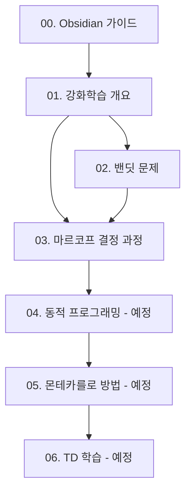

---
tags:
  - 가이드
  - Obsidian
  - 노트정리
aliases:
  - Obsidian 사용법
  - 옵시디언 가이드
date: 2026-03-11
---

# 00. Obsidian 활용 가이드

> [!tip] 이 가이드 파일은 이 폴더의 노트들에 사용된 기능들을 설명합니다.
> Obsidian을 처음 사용한다면 이 파일부터 읽으세요!

---

## 📁 이 폴더의 구조

```
강화학습_수업노트/
├── 00. Obsidian 활용 가이드.md  ← 지금 이 파일
├── 01. 강화학습 개요.md
├── 02. 밴딧 문제.md
└── 03. 마르코프 결정 과정.md
```

---

## 🚀 Obsidian 시작하기

### Vault 만들기
1. Obsidian 실행 → **"Open folder as vault"**
2. `강화학습_수업노트` 폴더 선택
3. 바로 노트 연결망을 볼 수 있어요!

---

## 💡 이 노트들에서 사용된 Obsidian 기능

### 1. YAML Frontmatter (노트 메타데이터)
모든 노트 상단의 `---` 사이 부분.

```yaml
---
tags:
  - 강화학습
  - 수업노트
aliases:
  - RL 개요
date: 2026-03-11
---
```

**활용법:**
- `tags`: 태그 검색 (`#강화학습`으로 전체 검색)
- `aliases`: 다른 이름으로 노트를 링크할 때 사용
- Obsidian에서 **Properties** 패널로 시각적으로 편집 가능

---

### 2. 내부 링크 `[[노트이름]]`
노트 간 연결의 핵심 기능!

```markdown
[[02. 밴딧 문제]]                    → 해당 노트로 이동
[[02. 밴딧 문제|밴딧 문제 보기]]    → 표시 텍스트 변경
[[02. 밴딧 문제#행동 가치]]          → 특정 섹션으로 이동
```

**Graph View**: 좌측 사이드바 → Graph 아이콘 → 노트 간 연결망 시각화

---

### 3. 콜아웃 박스 (Callout Boxes)
중요한 내용을 강조하는 박스.

```markdown
> [!note] 핵심 개념
> 내용 작성

> [!tip] 팁
> 내용 작성

> [!warning] 주의
> 내용 작성

> [!example] 예시
> 내용 작성

> [!question] 퀴즈
> 내용 작성

> [!important] 중요
> 내용 작성

> [!abstract] 요약
> 내용 작성
```

**결과 미리보기:**

> [!note] 이런 식으로 보입니다!

---

### 4. 수학 수식 (LaTeX)
Obsidian은 LaTeX 수식을 지원한다.

```markdown
인라인 수식: $Q(a) = \mathbb{E}[R \mid A = a]$

블록 수식:
$$v_\pi(s) = \mathbb{E}_\pi[G_t \mid S_t = s]$$
```

**Obsidian 설정**: Settings → Editor → **Render math in reading view** 활성화

---

### 5. 태그 활용법

```markdown
#강화학습    #수업노트    #MDP
```

**검색 팁:**
- 좌측 사이드바 → **Tags** 패널에서 태그별 노트 모아보기
- 검색창에서 `tag:#강화학습` 으로 필터링

---

### 6. Mermaid 다이어그램
코드 블록으로 다이어그램을 그릴 수 있다.

````markdown
```mermaid
graph LR
    A[에이전트] -->|행동 A_t| B[환경]
    B -->|상태 S_{t+1}, 보상 R_{t+1}| A
```
````

**결과:**


---

## 🔌 추천 플러그인

Obsidian은 커뮤니티 플러그인으로 기능을 확장할 수 있다.
**Settings → Community Plugins → Browse**

### 수업 노트에 유용한 플러그인

| 플러그인 | 기능 | 추천도 |
|---------|------|--------|
| **Dataview** | 노트를 데이터베이스처럼 쿼리 (예: 모든 수업노트 태그 목록) | ⭐⭐⭐⭐⭐ |
| **Templater** | 노트 템플릿 자동 생성 | ⭐⭐⭐⭐⭐ |
| **Calendar** | 날짜별 노트 관리 | ⭐⭐⭐⭐ |
| **Excalidraw** | 손그림 다이어그램 | ⭐⭐⭐⭐ |
| **Mind Map** | 마인드맵 시각화 | ⭐⭐⭐⭐ |
| **Spaced Repetition** | 플래시카드 복습 시스템 | ⭐⭐⭐⭐⭐ |

---

## 📐 Dataview 활용 예시

**Dataview** 플러그인 설치 후, 아래처럼 수업 노트를 자동으로 목록화 가능:

````markdown
```dataview
TABLE week, tags
FROM "강화학습_수업노트"
WHERE course = "강화학습"
SORT week ASC
```
````

---

## 🗂️ 노트 작성 템플릿

새 수업 노트를 만들 때 아래 템플릿을 사용하세요.

```markdown
---
tags:
  - 강화학습
  - 수업노트
date: {{date}}
week: {{week}}
course: 강화학습
---

# {{제목}}

## 📋 목차

---

## 핵심 개념

> [!note] 한 줄 요약
> ...

---

## 🔗 연결 노트

## 📚 핵심 수식 정리
```

---

## ⌨️ 자주 쓰는 단축키

| 단축키 | 기능 |
|--------|------|
| `Cmd/Ctrl + N` | 새 노트 생성 |
| `Cmd/Ctrl + O` | 노트 빠른 검색 |
| `Cmd/Ctrl + G` | Graph View 열기 |
| `Cmd/Ctrl + E` | 편집/읽기 모드 전환 |
| `[[` | 내부 링크 시작 |
| `Cmd/Ctrl + Shift + F` | 전체 검색 |

---

## 🔗 노트 연결 구조


