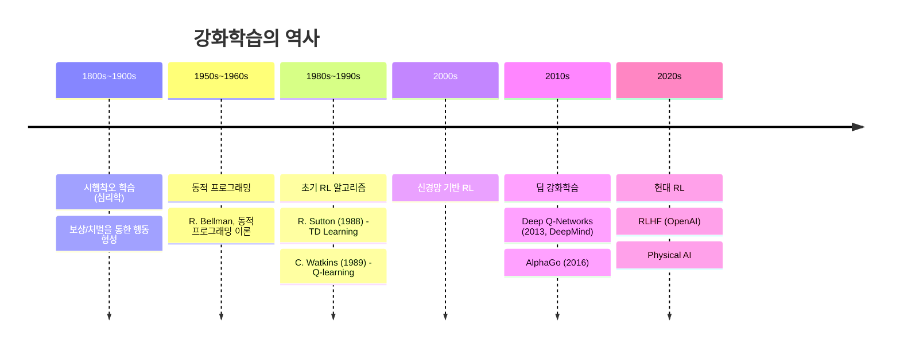

---
tags:
  - 강화학습
  - 수업노트
  - AI
  - 머신러닝
aliases:
  - RL 개요
  - Reinforcement Learning Introduction
date: 2026-03-11
week: 1
course: 강화학습
professor: 박태형 교수님 (충북대 지능시스템로봇공학과)
---

# 01. 강화학습 개요 (Introduction to Reinforcement Learning)

## 📋 목차
- [[#머신러닝의 종류]]
- [[#강화학습이란]]
- [[#강화학습의 핵심 구성요소]]
- [[#강화학습의 주요 응용 분야]]
- [[#강화학습의 도전 과제]]
- [[#강화학습의 역사]]
- [[#AI 기술의 진화]]
- [[#강의 개요]]

---

## 머신러닝의 종류

머신러닝은 크게 세 가지로 분류된다.

### ==지도학습 (Supervised Learning)==
- **학습 방식**: 입력과 ==정답(레이블)이 있는 데이터==로부터 학습
- **주요 과제**: 회귀(집값 예측), 분류(스팸 감지, 객체 탐지)
- **알고리즘**: 선형 회귀, 결정 트리, 신경망

### ==비지도학습 (Unsupervised Learning)==
- **학습 방식**: ==정답이 없는 데이터==로부터 패턴 학습
- **주요 과제**: 클러스터링(유사 데이터 그룹화), 차원 축소(데이터 단순화)
- **알고리즘**: K-means 클러스터링, PCA(주성분 분석)

### ==강화학습 (Reinforcement Learning)==
- **학습 방식**: 환경과 상호작용하며 시행착오를 통해 학습
- **주요 과제**: 순차적 의사결정 - 게임(체스), 자율주행, 로봇공학
- **알고리즘**: Q-learning, DQN, 정책 경사법(Policy Gradient)====

> [!quote] 강화(强化)학습의 심리학적 의미
> 보상과 처벌을 통해 **최적의 행동**을 학습하는 방법

---

## 강화학습이란

> [!note] 핵심 개념
> 강화학습은 **에이전트**가 **환경**과 상호작용하면서 **보상을 최대화**하는 방향으로 행동 정책을 학습하는 방법이다.

---

## 강화학습의 핵심 구성요소

### 1. ==에이전트 (Agent)== — 학습 주체
- 의사결정자 ==(플레이어)==
- 관찰한 것을 바탕으로 행동을 선택

### 2. ==환경 (Environment)== — 에이전트가 ==상호작용하는 대상==
- 에이전트의 행동에 반응
- 다음 상태(next state)와 보상(reward) 피드백 제공

### 3. ==상태 (State)== — 현재 상황
- 환경의 ==현재 상황==을 나타냄
- 에이전트가 다음 행동을 결정하는 데 사용

### 4. ==행동 (Action)== — ==에이전트가 할 수 있는 것==
- 에이전트는 현재 상태를 바탕으로 행동 선택

### 5. ==보상 (Reward)== — 환경으로부터의 ==피드백==
- 행동이 얼마나 좋았는지 알려주는 수치
- 목표: **시간에 걸쳐 총 보상을 최대화**

> [!example] 로봇 보행 문제 예시
> | 구성요소 | 내용 |
> |----------|------|
> | **에이전트** | 로봇 (제어기) |
> | **환경** | 도로, 장애물 |
> | **행동** | 각 다리 관절의 이동 각도/속도 |
> | **상태** | 장애물 위치 |
> | **보상** | 로봇이 이동한 거리 |

---

## 강화학습의 주요 응용 분야

강화학습은 **순차적 의사결정** 문제에 특히 강하다.

- 🎮 게임 / 스포츠 플레이
- 🚗 자율주행 자동차
- 🤖 로봇 매니퓰레이션
- 🦾 인간형 로봇 보행 (Humanoid Locomotion)

### 대표 예시
1. **CartPole** — 막대 균형 잡기
2. **Atari Breakout** — 벽돌 깨기 게임
3. **Biped Walker** — 두 발로 걷는 인간형 로봇
4. **Car Racing** — 자동차 경주 (상태/행동/보상 정의 필요)

---

## 강화학습의 도전 과제

> [!warning] 주요 난관
> 강화학습은 지도학습에 비해 훨씬 어려운 조건에서 학습이 이루어진다.

### 1. 희소하고 지연된 피드백 (Sparse & Delayed Feedback)
- 지도학습: 명확한 입출력 레이블 존재
- 강화학습: 보상만 존재하며, 종종 **지연되어** 제공됨

### 2. 비고정적·자기생성 데이터
- 지도학습: 고정된 독립적 데이터셋
- 강화학습: 데이터가 에이전트의 행동에 의존 → **탐색(Exploration) vs 활용(Exploitation) 트레이드오프**

### 3. 순차적·상호의존적 결정
- 행동이 미래 상태와 보상에 영향
- 단순 예측이 아닌, **시간에 걸친 정책 학습** 필요

### 4. 불안정하고 비용이 많이 드는 훈련
- 보상이 노이즈가 많거나 희소 → **높은 분산**
- 작은 변화가 큰 행동 차이로 이어질 수 있음 → **불안정성**
- 실제 환경 데이터 수집은 느리고 비용이 큼

---

## 강화학습의 역사

---

## AI 기술의 진화

현대 AI는 세 단계로 진화하고 있다 (ICROS 2025 기준).

| 구분 | 판단형 AI | 생성형 AI | 행동형 AI |
|------|----------|----------|----------|
| **능력** | 지각 | 사고 | 행동 |
| **기술** | Vision Intelligence | 자연어 처리 | 로보틱스 |
| **학습** | 지도학습 기반 | 비지도학습 기반 | **강화학습 기반** |
| **키워드** | Learn to See | Learn to Think | **"Learn to Act"** |

> [!tip] 행동형 AI
> 강화학습은 AI가 단순히 보고 생각하는 것을 넘어 **직접 행동하는** 단계의 핵심 기술이다.

---

## 강의 개요

### 교재
- 밑바닥부터 시작하는 딥러닝 4 (강화학습 편)
- GitHub: https://github.com/WegaLee/deep-learning-from-scratch-4

### 강의 커리큘럼

| 주차 | 주제 |
|------|------|
| 1주 | [[01. 강화학습 개요\|Introduction]] |
| 2주 | [[03. 마르코프 결정 과정\|Markov Decision Process]] |
| 3~4주 | Dynamic Programming |
| 5주 | Monte Carlo Method |
| 6~7주 | Temporal Difference Method |
| 8주 | Neural Networks |
| 9주 | Q Network |
| 10주 | DQN |
| 11주 | Policy Based Method |
| 12주 | Advanced RL |
| 13주 | Term Projects |

### 성적 배분
- 📝 시험 (중간 + 기말): **60%**
- 🛠️ 과제 (Projects + HWs): **40%**
- ⚠️ 출석: 결석/지각 감점, 1/4 결석 시 F 처리

---

## 🔗 연결 노트
- [[02. 밴딧 문제]] — 상태 없는 단순화된 RL 문제
- [[03. 마르코프 결정 과정]] — RL의 수학적 토대

## 📚 참고 자료
- Sutton & Barto, "Reinforcement Learning: An Introduction"
- DeepMind DQN 논문 (2013)

이 문서에서는 에이전트가 누적 보상을 최대화하기 위해 환경과 상호작용하여 결정을 내리는 방법을 학습하는 기계 학습 유형인 강화 학습(RL)에 대한 개요를 제공합니다. 다루는 주요 내용을 요약하면 다음과 같습니다.

### 1. 머신러닝의 종류
- **지도 학습**: 레이블이 지정된 데이터에서 학습하여 회귀 및 분류와 같은 작업을 수행합니다.
- **비지도 학습**: 레이블이 지정되지 않은 데이터에서 패턴을 발견하며 클러스터링 및 차원 축소에 유용합니다.
- **강화 학습**: 환경과의 시행착오 상호 작용을 통해 최적의 행동을 학습합니다.

### 2. 강화학습이란 무엇인가요?
강화 학습에는 누적 보상의 개념을 최대화하기 위해 에이전트가 환경에서 결정을 내리는 것이 포함됩니다.

### 3. 강화 학습의 핵심 구성 요소
- **에이전트**: 학습자 또는 의사결정자입니다.
- **환경**: 에이전트가 상호작용하는 세계입니다.
- **상태**: 현재 상황을 표현합니다.
- **Action**: 상담원이 선택할 수 있는 항목입니다.
- **보상**: 취해진 조치에 따라 환경으로부터 피드백을 받습니다.

### 4. 강화학습의 응용
RL은 게임, 자율주행, 로봇공학, 휴머노이드 이동 등 순차적인 의사결정이 필요한 분야에 활용된다.

### 5. 강화 학습의 과제
여기에는 희박하고 지연된 피드백, 작업으로 생성된 고정되지 않은 데이터, 의사 결정의 순차적 종속성 및 교육 불안정성을 처리하는 것이 포함됩니다.

### 6. 강화학습의 역사
타임라인은 심리학(시행 오류 학습), 동적 프로그래밍의 개발, TD 학습 및 Q-학습과 같은 초기 RL 알고리즘, 심층 강화 학습을 포함한 현대 발전에 뿌리를 두고 있습니다.

### 7. AI 기술의 진화
AI는 다음을 통해 발전했습니다.
- 인식(비전 인텔리전스)
- 생각(자연어처리)
- 액션(강화학습을 통한 로봇공학)

### 8. 과정 개요
이 과정에서는 "Deep Learning from Scratch"를 교과서로 사용하고 몇 주에 걸쳐 Markov 결정 프로세스부터 고급 RL 기술까지의 주제를 다룹니다.

이 가이드는 기계 학습 패러다임 내에서 강화 학습을 이해하거나 연구하는 데 관심이 있는 모든 사람을 위한 포괄적인 소개 역할을 합니다.