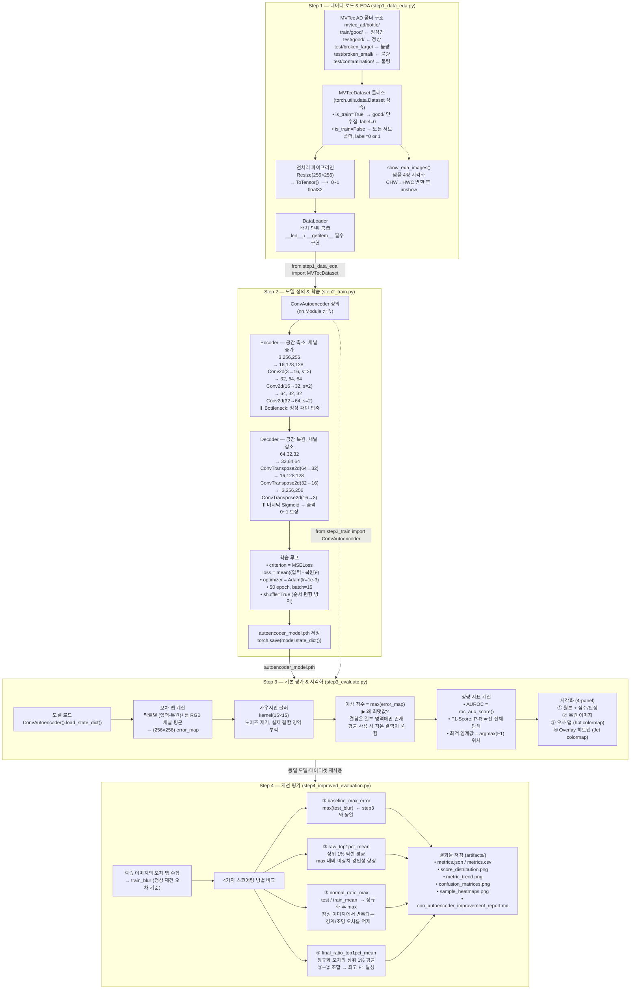

# MVTec AD 이상 탐지 파이프라인 전체 흐름

## 전체 아키텍처 개요



---

## 핵심 개념 상세 설명

### 1. 비지도학습 이상 탐지 원리

```
학습 시 (정상만)          추론 시
┌───────────┐            ┌──────────────────────────────────────────────────────┐
│ 정상 이미지  │  →  모델  →  정상 이미지: 복원 오차 작음 (학습된 패턴) ✅ 정상 판정   │
│ (불량 없음)  │            │  불량 이미지: 복원 오차 큼  (미학습 패턴) ❌ 불량 판정   │
└───────────┘            └──────────────────────────────────────────────────────┘
```

- 레이블이 필요 없는 **비지도학습** (MVTec 학습셋은 정상 이미지만 존재)
- 핵심 가정: 불량 패턴은 학습 중 본 적 없으므로 복원 품질이 나쁨

---

### 2. ConvAutoencoder 텐서 크기 변화

```
입력                    Encoder                          Bottleneck
(B, 3, 256, 256)
  ↓ Conv2d(3→16, s=2)
(B,16, 128, 128)   ← stride=2로 MaxPool 없이 학습 가능한 다운샘플링
  ↓ Conv2d(16→32, s=2)
(B,32,  64,  64)
  ↓ Conv2d(32→64, s=2)
(B,64,  32,  32)   ← 정상 패턴의 핵심이 64채널 32×32에 압축됨

                              Decoder
                (B,64, 32, 32)
                  ↓ ConvTranspose2d(64→32, s=2, output_padding=1)
                (B,32, 64,  64)
                  ↓ ConvTranspose2d(32→16, s=2, output_padding=1)
                (B,16,128, 128)
                  ↓ ConvTranspose2d(16→3,  s=2, output_padding=1) + Sigmoid
                (B, 3,256, 256)   ← 출력값 0~1 (입력과 동일 범위)
```

> `output_padding=1`: `stride=2` 전치 합성곱에서 출력이 홀수 크기가 될 수 있어, 대칭 복원을 위해 한 변에 1픽셀 추가

---

### 3. MSE 손실과 이상 점수의 관계

| 단계 | 수식 | 목적 |
|------|------|------|
| 학습 | `loss = mean((x - x̂)²)` | 전체 배치 평균으로 역전파 |
| 평가 오차 맵 | `E[h,w] = mean_c((x[c,h,w] - x̂[c,h,w])²)` | 픽셀별 RGB 평균 오차 → (256×256) |
| 이상 점수 (Step 3) | `score = max(GaussianBlur(E))` | 이미지 단 하나의 스칼라 |
| 이상 점수 (Step 4 final) | `score = top1%_mean(E / E_normal)` | 정규화 후 상위 1% 평균 |

---

### 4. 임계값 자동 탐색 (P-R 곡선 방식)

```python
precisions, recalls, thresholds = precision_recall_curve(y_true, y_scores)
f1_scores = 2 * P * R / (P + R + 1e-8)   # 모든 임계값에 대해 벡터 계산
best_threshold = thresholds[argmax(f1_scores)]
```

- ROC 기반 임계값보다 **클래스 불균형에 강인**
- 임계값을 직접 지정하지 않고 **데이터 기반으로 최적값 자동 결정**

---

### 5. Step 4 개선 핵심: 정규화 오차 (Normal Ratio)

```
문제: 정상 이미지도 병 경계·조명 영역은 항상 복원 오차가 높음
      → 이 영역이 threshold를 높게 만들어 실제 결함을 가림

해결:
  train_mean[h,w] = 학습 이미지들의 픽셀(h,w) 평균 오차
  ratio[h,w]      = test_error[h,w] / (train_mean[h,w] + 1e-6)

  → 정상적으로 복원이 어려운 위치는 분모가 크므로 ratio가 작아짐
  → 새로운 결함(학습에 없던 패턴)만 ratio가 크게 부각됨
```

---

### 6. 스코어링 4가지 방법 비교 요약

| 방법 | 수식 | 장점 | 단점 |
|------|------|------|------|
| `baseline_max_error` | `max(blur(E_test))` | 단순, 빠름 | 경계/조명 노이즈에 취약 |
| `raw_top1pct_mean` | `top1%(blur(E_test))` | max 이상치 강인성 ↑ | 여전히 정상 오차 미제거 |
| `normal_ratio_max` | `max(E_test / E_train_mean)` | 정상 오차 억제 | 단일 픽셀 max → 불안정 |
| `final_ratio_top1pct_mean` | `top1%(E_test / E_train_mean)` | 정규화 + 안정성 | 학습 오차 수집 필요 |

---

### 7. 시각화 출력물 (Step 4)

```
artifacts/
├── metrics.json              ← 4가지 방법의 AUROC, F1, Precision, Recall, Threshold
├── metrics.csv               ← 동일 내용 CSV (혼동 행렬 포함)
├── score_distribution.png    ← baseline vs final: 정상/불량 점수 분포 히스토그램
├── metric_trend.png          ← 4가지 방법의 F1, AUROC 추이 그래프
├── confusion_matrices.png    ← baseline vs final: 혼동 행렬
└── sample_heatmaps.png       ← 정상 정답·불량 정답·불량 오탐 3케이스 시각화
```

---

### 8. 파일 의존 관계

```
step1_data_eda.py
  └─ MVTecDataset 클래스 정의
       ├─── step2_train.py     (from step1_data_eda import MVTecDataset)
       ├─── step3_evaluate.py  (from step1_data_eda import MVTecDataset)
       └─── step4_improved_evaluation.py (동일)

step2_train.py
  └─ ConvAutoencoder 클래스 + 학습 → autoencoder_model.pth 저장
       ├─── step3_evaluate.py  (from step2_train import ConvAutoencoder)
       └─── step4_improved_evaluation.py (동일)

autoencoder_model.pth
  └─── step3, step4에서 torch.load()로 가중치 복원
```
